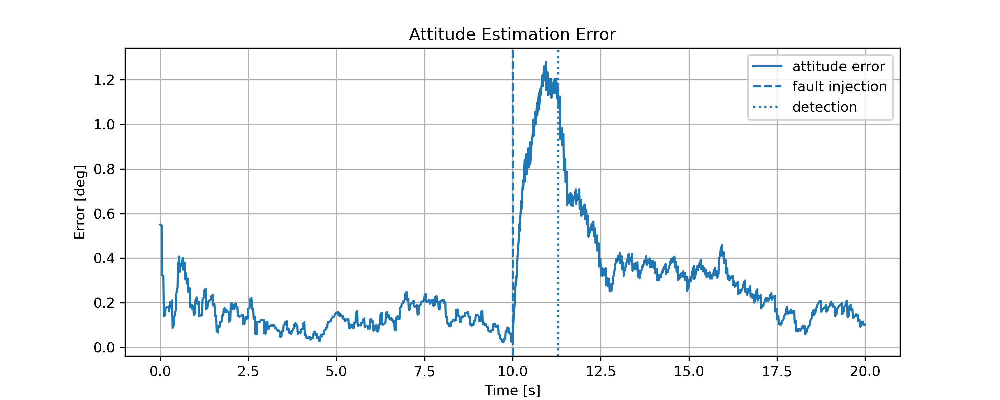
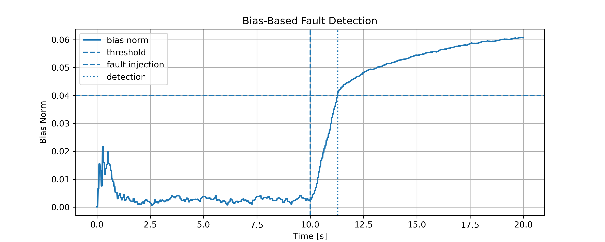
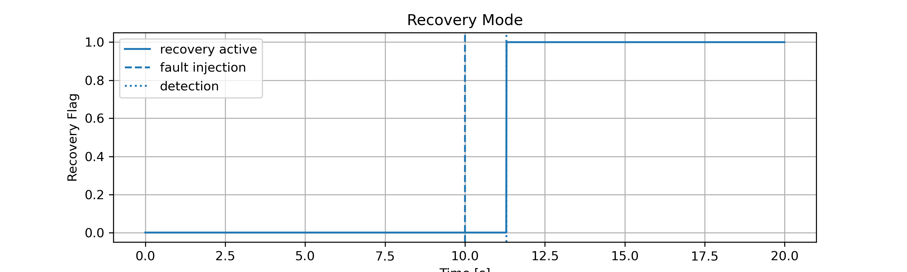
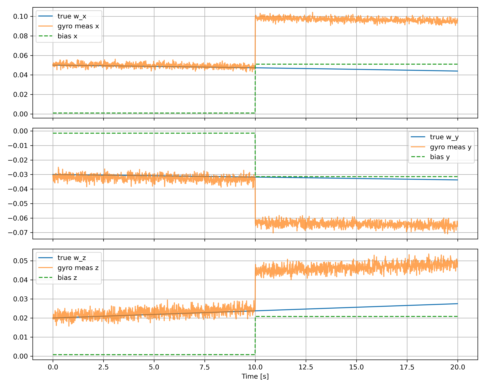

# Spacecraft Attitude Estimation with Error-State EKF and FDIR

A Python-based project for spacecraft attitude estimation using quaternion dynamics, IMU and star tracker sensor fusion, an error-state Extended Kalman Filter (EKF), Monte Carlo validation, and fault detection, isolation, and recovery (FDIR).

---

## Overview

This project simulates spacecraft rotational dynamics and estimates vehicle attitude using an error-state EKF. The estimator fuses:

- Gyroscope measurements with noise, bias, and random walk  
- Star tracker attitude measurements  

The system also includes:

- Monte Carlo robustness analysis  
- Injected gyro fault scenarios  
- Bias-based fault detection  
- Startup detection gating (prevents false alarms)  
- Adaptive recovery after fault detection  

---

## Features

### Estimation
- Quaternion-based attitude propagation  
- Error-state EKF for attitude and gyro bias estimation  
- Sensor fusion (IMU + star tracker)  

### Validation
- Time-domain attitude error analysis  
- Monte Carlo simulation for robustness  

### FDIR (Fault Detection, Isolation, Recovery)
- Gyro bias fault injection  
- Residual monitoring  
- Bias-based fault detection  
- Startup transient guard  
- Detection delay measurement  
- Recovery mode with covariance inflation  
- Adaptive bias estimation during recovery  

---

## Example Results

### Attitude Estimation Error


### Bias-Based Fault Detection


### Recovery Mode Activation


### Gyro Measurements and Bias


---

## System Workflow

Truth Dynamics
↓
Sensor Models (Gyro + Star Tracker)
↓
EKF Prediction
↓
EKF Update
↓
Fault Detection (FDIR)
↓
Recovery Mode

---

## Key Concepts

- Error-State Kalman Filter  
- Quaternion Attitude Representation  
- Sensor Fusion  
- Gyro Bias Estimation  
- Monte Carlo Analysis  
- Fault Detection and Recovery  

---

## Typical Performance

### Nominal Case
- Attitude error: ~0.05 to 0.2 degrees  

### Faulted Case (Gyro Bias Jump)
- Error spike during fault  
- Detection delay: ~0.5–1.2 seconds  
- Recovery stabilizes estimator  
- Final error bounded ~0.2–0.4 degrees  

---

## Repository Structure

- **main.py** — simulation loop and integration  
- **monte_carlo.py** — Monte Carlo analysis  
- **config.py** — simulation parameters  
- **dynamics.py** — spacecraft rotational dynamics  
- **sensors.py** — sensor models  
- **ekf.py** — error-state EKF  
- **fdir.py** — fault detection and recovery  
- **plots.py** — plotting utilities  
- **utils.py** — quaternion math  
- **results/** — saved plots  
- **docs/** — documentation  
- **architecture.md** — system design notes  

---

## How to Run

### 1. Run the main simulation

```bash
python main.py
python monte_carlo.py
