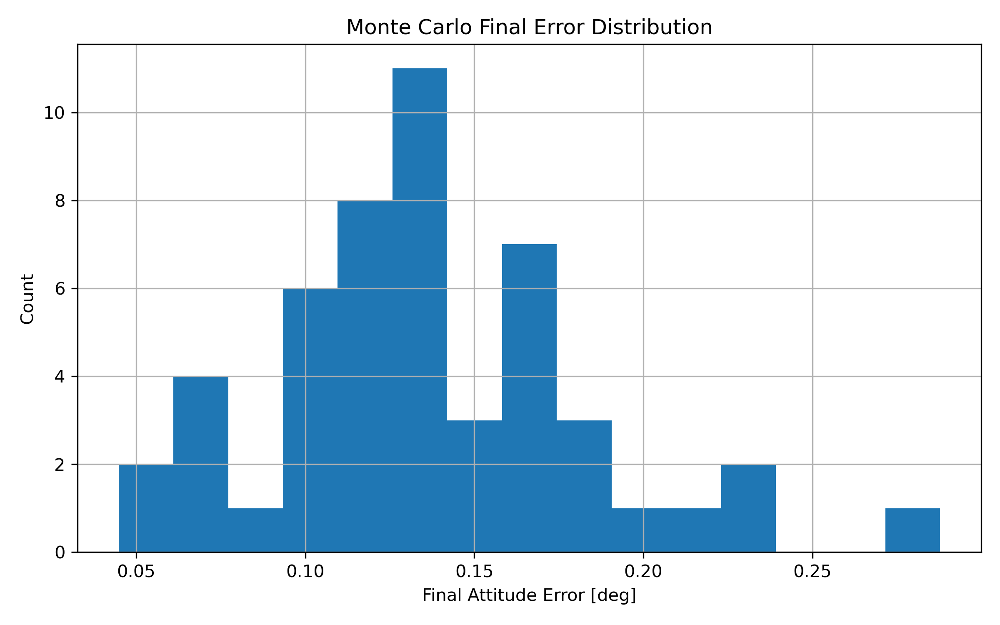

# Spacecraft Attitude Estimation with Error-State EKF and FDIR

A Python-based project for spacecraft attitude estimation using quaternion dynamics, IMU and star tracker sensor fusion, an error-state Extended Kalman Filter (EKF), Monte Carlo validation, and fault detection, isolation, and recovery (FDIR).

---

## Overview

This project simulates spacecraft rotational dynamics and estimates vehicle attitude using an error-state EKF. The estimator fuses:

- Gyroscope measurements with noise, bias, and random walk  
- Star tracker attitude measurements  

The system also includes:

- Monte Carlo robustness analysis  
- Injected gyro fault scenarios  
- Bias-based fault detection  
- Startup detection gating (prevents false alarms)  
- Adaptive recovery after fault detection  

---

## System Workflow

```text
Truth Dynamics
    ↓
Sensor Models (Gyro + Star Tracker)
    ↓
EKF Prediction
    ↓
EKF Update
    ↓
Fault Detection (FDIR)
    ↓
Recovery Mode
```

---

## Features

### Estimation
- Quaternion-based attitude propagation  
- Error-state EKF for attitude and gyro bias estimation  
- Sensor fusion (IMU + star tracker)  

### Validation
- Time-domain attitude error analysis  
- Monte Carlo simulation for robustness  

### FDIR (Fault Detection, Isolation, Recovery)
- Gyro bias fault injection  
- Residual monitoring  
- Bias-based fault detection  
- Startup transient guard  
- Detection delay measurement  
- Recovery mode with covariance inflation  
- Adaptive bias estimation during recovery  

---

## Example Results

### Attitude Estimation Error


### Bias-Based Fault Detection


### Recovery Mode Activation


### Gyro Measurements and Bias


### Monte Carlo Final Error Distribution


---

## Typical Performance

### Nominal Case
- Attitude error: ~0.05 to 0.2 degrees  

### Faulted Case (Gyro Bias Jump)
- Error spike during fault  
- Detection delay: ~0.5–1.2 seconds  
- Recovery stabilizes estimator  
- Final error bounded ~0.2–0.4 degrees  

---

## Repository Structure

```text
.
├── main.py              # Simulation loop and integration
├── monte_carlo.py       # Monte Carlo analysis
├── config.py            # Simulation parameters
├── dynamics.py          # Spacecraft rotational dynamics
├── sensors.py           # Sensor models (gyro, star tracker)
├── ekf.py               # Error-state EKF
├── fdir.py              # Fault detection and recovery logic
├── plots.py             # Plotting utilities
├── utils.py             # Quaternion math and helpers
├── results/             # Saved plots
└── docs/
    └── architecture.md  # System design notes
```

---

## How to Run

```bash
# Install dependencies
pip install -r requirements.txt

# Run the main simulation (EKF + fault injection + plots)
python main.py

# Run Monte Carlo analysis (multiple runs + statistics + histogram)
python monte_carlo.py
```

The main simulation runs the full spacecraft attitude estimation pipeline, including EKF propagation, fault injection, detection, recovery, and generates plots saved in the `results/` folder.

The Monte Carlo script executes multiple simulation runs to evaluate robustness, producing a histogram of final attitude error and reporting statistical metrics such as mean and standard deviation.

---

## Architecture Notes

See `docs/architecture.md` for details on:

- EKF state formulation  
- Bias estimation strategy  
- Fault detection logic  
- Recovery design decisions  

---

## Key Insight

Gyro faults affect the **prediction model**, not directly the measurement.

Therefore:
- Residual-based detection may not trigger  
- Bias estimation provides a more reliable fault indicator  

---

## Future Improvements

- Full 6-DOF translational + rotational dynamics  
- GPS-based navigation integration  
- NEES/NIS consistency testing  
- Multi-sensor fault isolation  
- Unscented Kalman Filter (UKF) implementation  
- Fault Monte Carlo (detection rate, delay statistics)   
